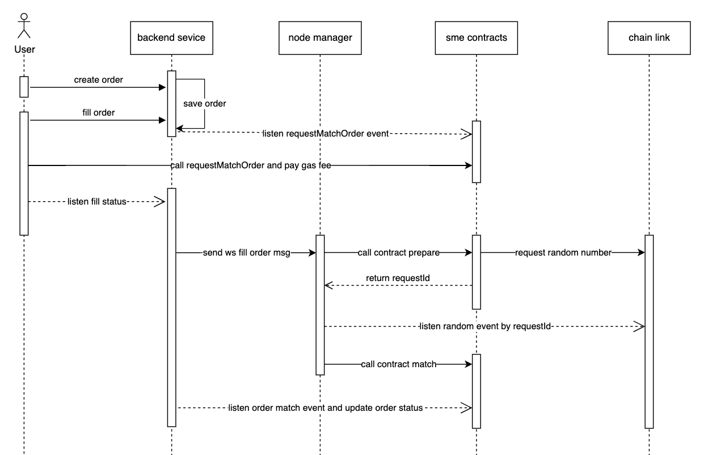

# SME contracts

The SME contracts is a market protocol based on Seaport for safely and efficiently buying and selling NFTs.


## System Architecture Diagram



## Install

To install dependencies and compile contracts:

```bash
git clone --recurse-submodules https://github.com/0xMCG/sme-contracts && cd sme-contracts
yarn install
yarn build
```

## Usage

To run hardhat tests written in javascript:

1.Rebuild all contracts and run tests
```bash
yarn test
```

2.Rebuild changed contracts and run tests
```bash
yarn test:quick
```

3.Deploy contracts
need config .env
PRIVATE_KEY=deployer private key    
```bash
// re build and deploy
yarn deploy 
// quick build and deploy
yarn deploy:quick
```
## License

[MIT](LICENSE) Copyright 2023 Ozone Networks, Inc.
